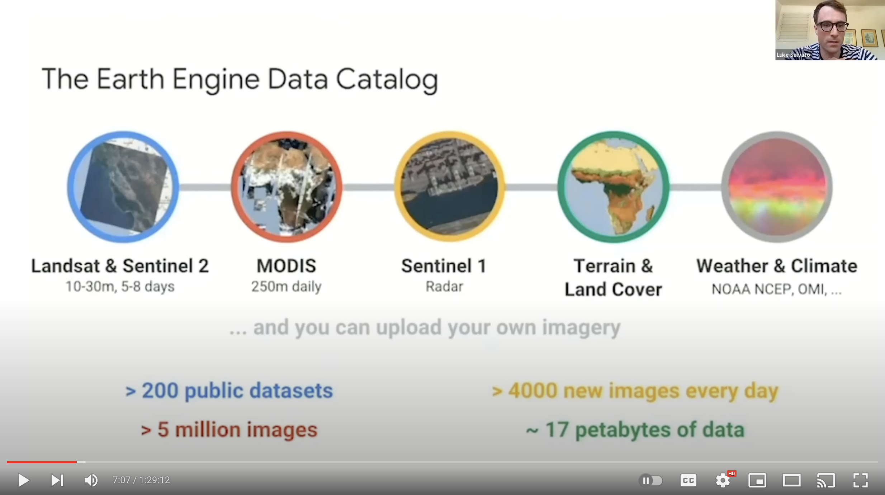

# Intro to Google Earth Engine
#### Intro to GEE workshop for MapTime Davis

  
  
I teach this workshop for MapTime Davis every few months. It is designed for first-time or beginner Google Earth Engine Users looking to gain familiariry with the GEE interface, learn how to access remote sensing data in the cloud, and experience the power of computing in GEE. 
  
By the end of this workshop you will have visualized maps made in GEE, computed slope for the entire planet, and computed seasonal NDVI (a measure of plant greenness/productivity) for the entire planet!!   
  
Objectives of this workshop: feel comfortable starting your own project in GEE and gain access to the GEE community where you can find help and mentorship.  

  

## Initial Setup
1. Get a google account (accounts.google.com)

2. Register for earth engine (earthengine.google.com/signup) - You need to register to access GEE

3. Be careful about what google account you use when you log in, this can lead to confusion! Consider opening with an incognito window

## Tutorial scripts:  
Once you have registered for GEE, you can click this link to get reader access to the scripts used in this tutorial.
https://code.earthengine.google.com/?accept_repo=users/lasalvato/MapTimeDavis_intro_to_GEE

## Video  
Click below to access the video recording:  

  
  

## Resources for learning more:
1. Youtube videos: 
    1. part 1: https://www.youtube.com/watch?v=I-wFYm4Hnhg&t=1637s
    2. part 2: https://www.youtube.com/watch?v=_Ff8_dME2Gc
    10. My tutorial is an abridged and adapted version of these two videos. They are really good, and a bit more in depth than my workshop
2. Earth Engine Guides: https://developers.google.com/earth-engine/guides. These are well documented!
3. Data catalog: https://developers.google.com/earth-engine/datasets
4. UC Davis earth-engine slack channel
5. Geospatial list serv. <geospatial@ucdavis.edu> This is a quiet but effective list. Great for posting code questions, getting advice on geospatial projects, and even finding jobs.
6. New GEE text book: https://www.eefabook.org/go-to-the-book.html
7. Example apps: https://www.earthengine.app/

